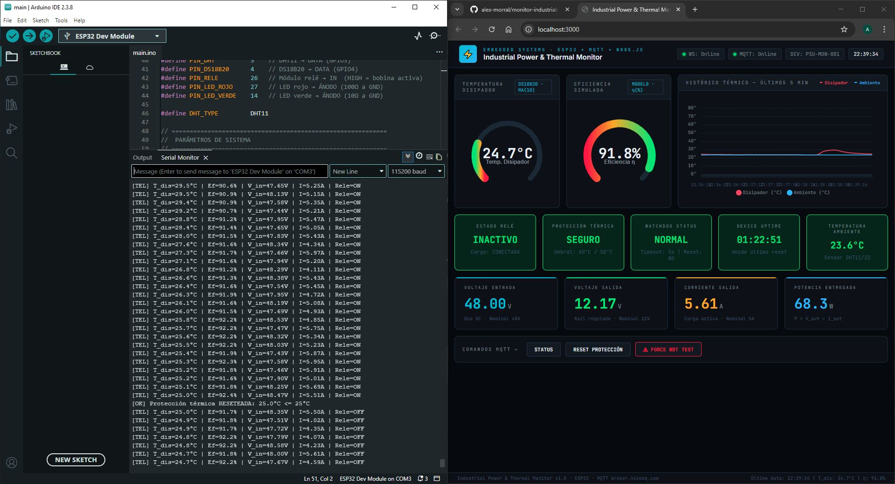
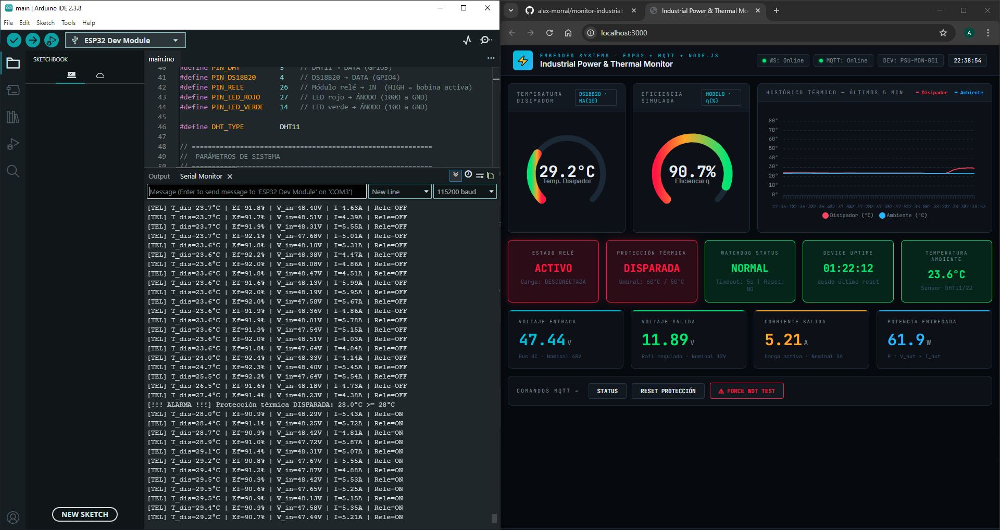
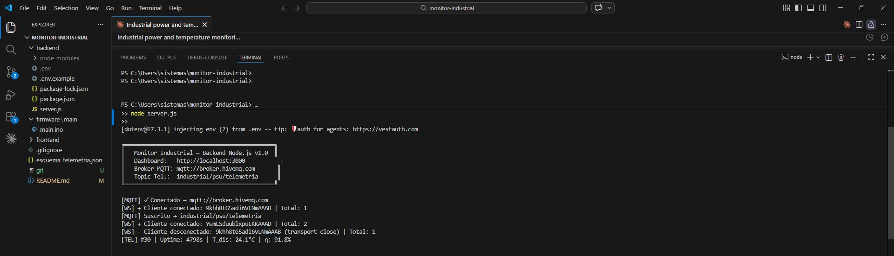
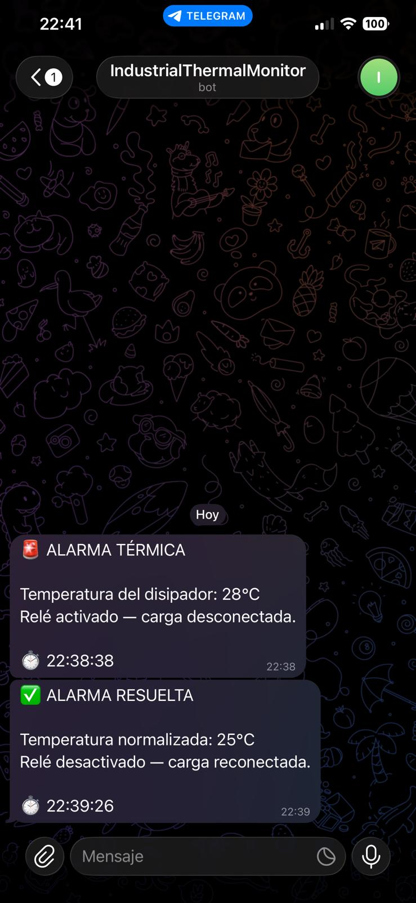
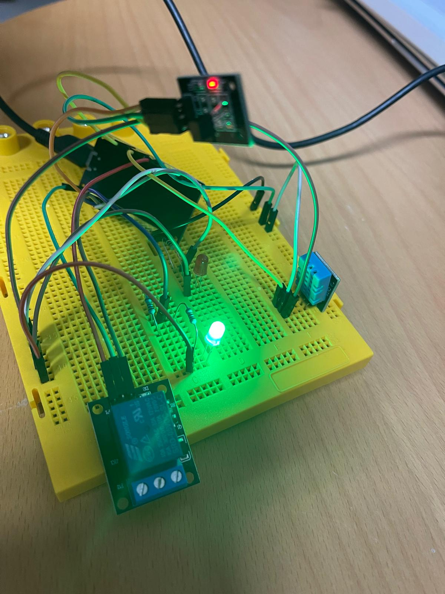
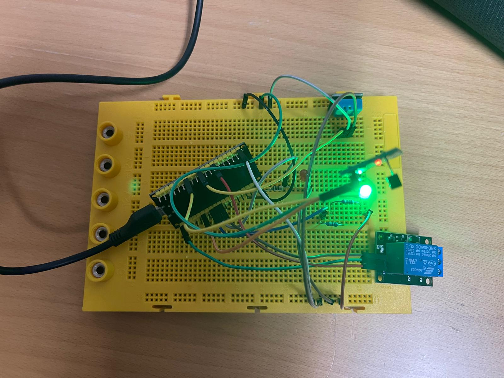
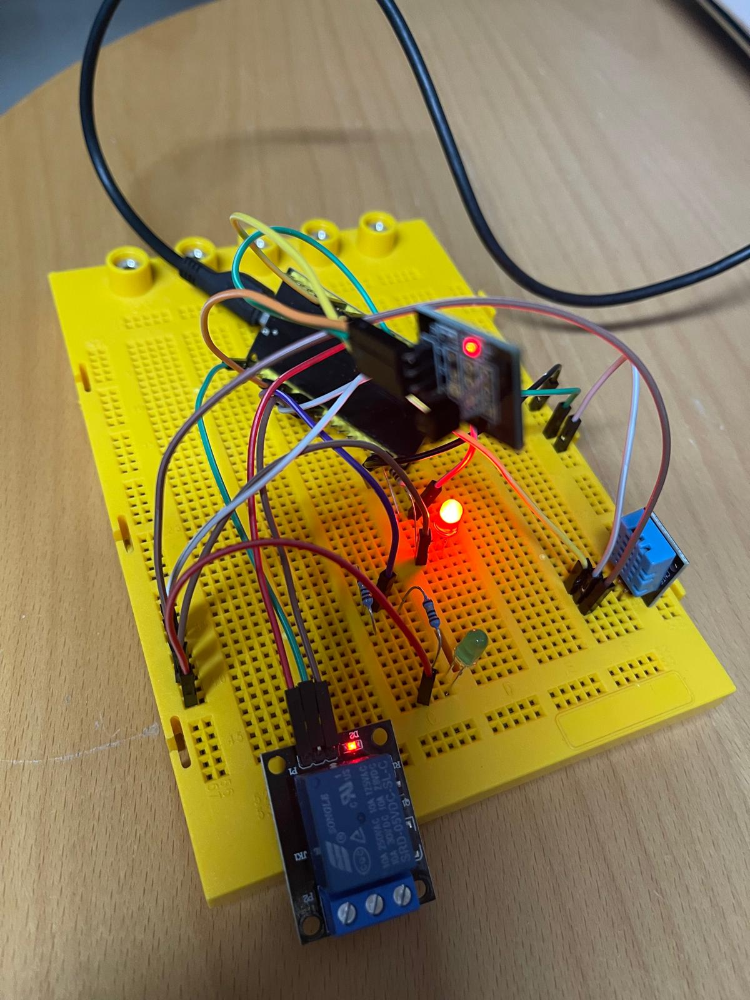
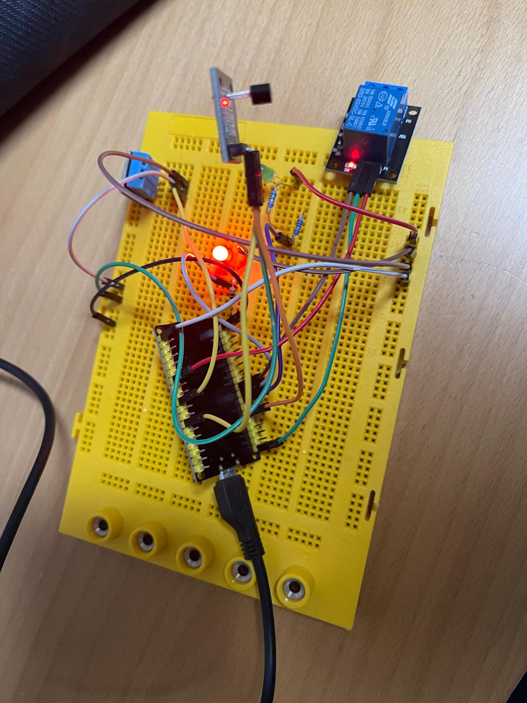

# Industrial Power & Thermal Monitor — ESP32 + MQTT

Real-time industrial thermal and power monitoring system built with ESP32, MQTT, Node.js and a live web dashboard. Features hardware-level thermal protection, Watchdog supervision and Telegram alerts.


---

## What it does

An ESP32 reads temperature from a DS18B20 sensor (heatsink) and a DHT11 (ambient). If the heatsink temperature exceeds 28°C, the ESP32 immediately activates a relay to cut the load and triggers a red LED — all locally, without depending on internet connectivity. A Telegram alert is sent when the alarm fires and when it clears.

All thermal, power and status data is published via MQTT every second and displayed on a real-time web dashboard.

---

## System Architecture

```
ESP32 (sensors + relay + LEDs)
        │
        │  WiFi + MQTT (HiveMQ public broker)
        ▼
Node.js Backend  ──── Telegram Bot API
        │
        │  WebSocket (Socket.io)
        ▼
Web Dashboard (real-time charts + gauges)
```

---

## Hardware

| Component | Purpose | Pin |
|---|---|---|
| ESP32 DevKit v1 | Main microcontroller | — |
| DS18B20 (Keyes module) | Heatsink temperature | GPIO 4 |
| DHT11 | Ambient temperature | GPIO 5 |
| Relay module | Load protection | GPIO 26 |
| Red LED + 100Ω | Thermal alarm indicator | GPIO 27 |
| Green LED + 2×10Ω | System OK indicator | GPIO 14 |

---

## Features

- 🌡️ **Dual temperature sensing** — DS18B20 (heatsink) + DHT11 (ambient)
- ⚡ **Local edge protection** — relay triggers at 28°C independently of internet
- 🔁 **Hysteresis control** — trip at 28°C, reset at 25°C (prevents relay chatter)
- 📊 **Moving average filter** — smooths DS18B20 readings (window = 10 samples)
- 🐕 **Hardware Watchdog (WDT)** — auto-resets ESP32 if firmware hangs (5s timeout)
- 📡 **MQTT telemetry** — JSON payload published every second
- 📈 **Real-time dashboard** — gauges, historical chart, power metrics
- 📱 **Telegram alerts** — instant notification on alarm and recovery
- 🔌 **Auto-reconnect** — WiFi and MQTT reconnect automatically on failure
- 🔋 **Simulated power model** — 48V→12V@5A Power Supply Unit with thermal efficiency degradation

---

## Screenshots

### Dashboard — Normal State


### Dashboard — Thermal Alarm Active


### Backend Terminal


### Telegram Alerts


### Hardware — System OK (Green LED)



### Hardware — Thermal Alarm (Red LED)



---

## Tech Stack

| Layer | Technology |
|---|---|
| Firmware | C++ (Arduino IDE) — ESP32 |
| Protocol | MQTT (HiveMQ public broker) |
| Backend | Node.js + Express + Socket.io |
| Frontend | HTML + CSS + ApexCharts |
| Alerts | Telegram Bot API |

---

## Getting Started

### Requirements
- Arduino IDE 2.x with ESP32 board support
- Node.js 18+

### Arduino libraries (Library Manager)
- PubSubClient (Nick O'Leary)
- DHT sensor library (Adafruit)
- ArduinoJson (Benoit Blanchon)
- OneWire (Paul Stoffregen)
- DallasTemperature (Miles Burton)

### Firmware setup

1. Open `firmware/main/main.ino` in Arduino IDE
2. Edit your credentials:
```cpp
const char* WIFI_SSID = "YOUR_SSID";
const char* WIFI_PASS = "YOUR_PASSWORD";
```
3. Select `Tools → Board → ESP32 Dev Module`
4. Upload to the ESP32

### Backend setup

```bash
cd backend
npm install
```

Create your `.env` file from the example:
```bash
cp .env.example .env
```

Edit `.env` with your Telegram credentials:
```
TELEGRAM_TOKEN=your_bot_token
TELEGRAM_CHAT_ID=your_chat_id
```

Start the server:
```bash
node server.js
```

Open the dashboard at `http://localhost:3000`

---

## MQTT Topics

| Topic | Direction | Description |
|---|---|---|
| `industrial/monitor/telemetria` | ESP32 → Backend | JSON telemetry every 1s |
| `industrial/monitor/cmd` | Backend → ESP32 | Commands |

### Available commands

| Command | Effect |
|---|---|
| `STATUS` | Print current status to Serial |
| `RESET_PROTECCION` | Manually reset relay and alarm |
| `FORCE_WDT_TEST` | Trigger infinite loop → WDT resets ESP32 in 5s |

---

## Telemetry JSON

```json
{
  "meta": {
    "id_dispositivo": "MON-001",
    "tiempo_encendido_s": 120,
    "watchdog_reiniciado": false
  },
  "potencia": {
    "voltaje_entrada": 48.12,
    "voltaje_salida": 12.01,
    "corriente_salida": 4.97,
    "eficiencia_calculada_pct": 91.3
  },
  "termico": {
    "temp_disipador_c": 32.5,
    "temp_ambiente_c": 24.1
  },
  "estado": {
    "rele_activo": false,
    "proteccion_termica_disparada": false
  }
}
```

---

## License

MIT

